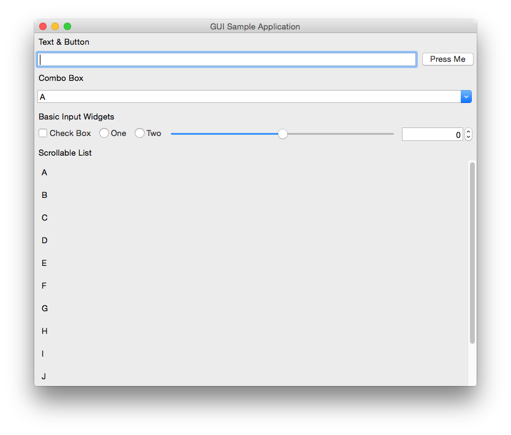
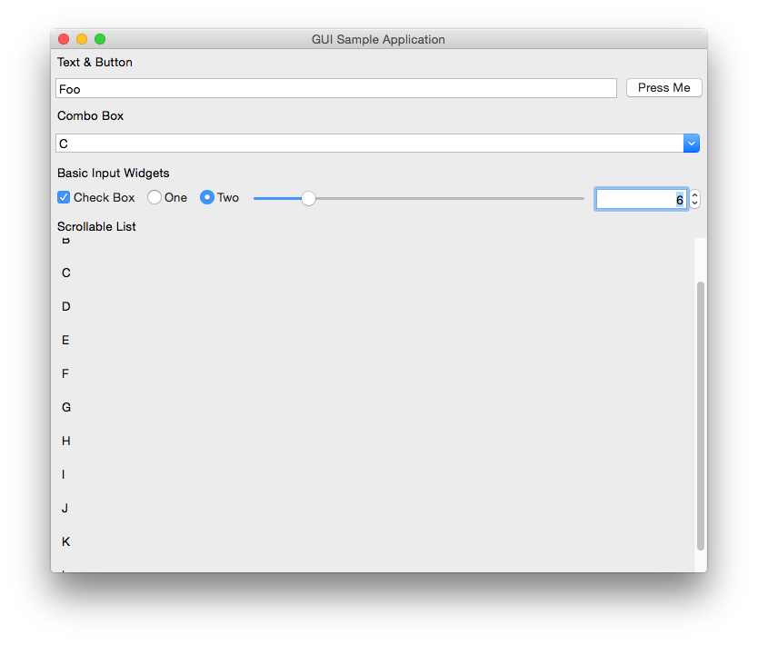

# GUIs/c++/wxWidgets

It's wxWidgets.

## Screenshots

### Windows

### Mac OS

## Metrics

- Lines of code: **137** (counted naïvely)
- Distinct API calls: **21** (decided somewhat arbitrarily)
- Launch time: (measured on a system under normal load with /misc/MeasureTiming.ahk)
  - Win32 Debug: **0.361018 s**
  - Win32 Release: **0.227847 s**
- Idle RAM usage: (measured by Windows on a system under normal load)
  - Win32 Debug: **2,284 K**
  - Win32 Release: **2,120 K**
  - Mac OS: **9.2 MB**
- Executable size: (measured by Windows, statically linking msvcrt)
  - Win32 Debug: **7.89 MB**
  - Win32 Release: **3.10 MB**
  - Mac OS: **5.9 MB**
