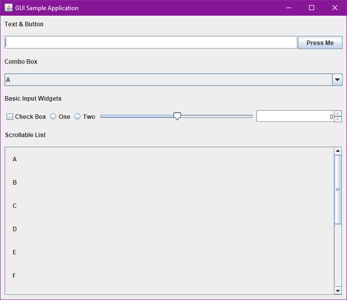
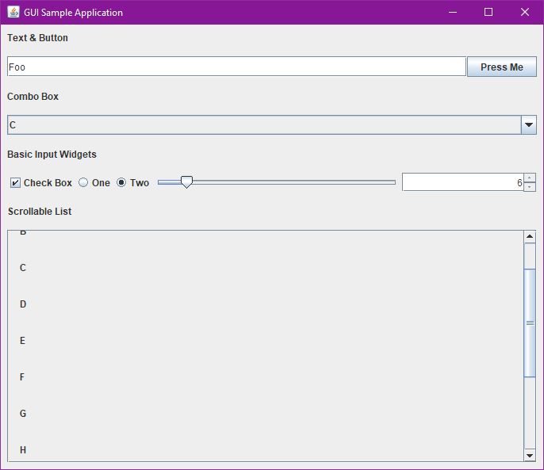

# GUIs/java/Swing

It's Swing.

## Screenshots

### Windows

## Metrics

- Lines of code: **131** (counted naïvely)
- Distinct API calls: **26** (decided somewhat arbitrarily)
- Launch time: (measured on a system under normal load with /misc/MeasureTiming.ahk)
  - through Eclipse: **0.643199 s**
  - from a .jar: **0.887025 s**
- Idle RAM usage: **18,704 K** (measured by Windows on a system under normal load)
- Executable size: **4.09 KB** (measured by Windows, .jar)
