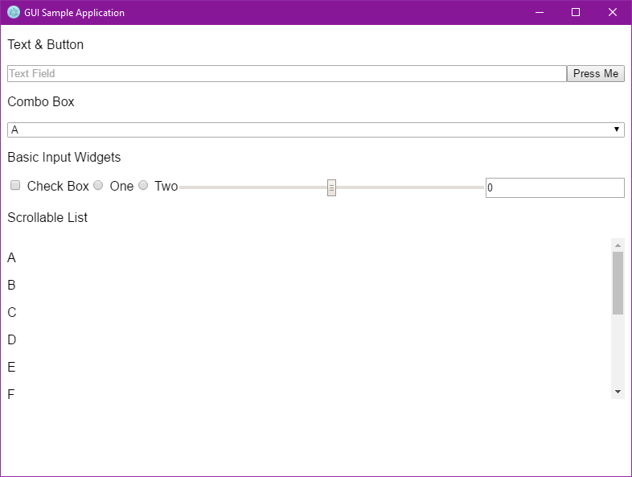
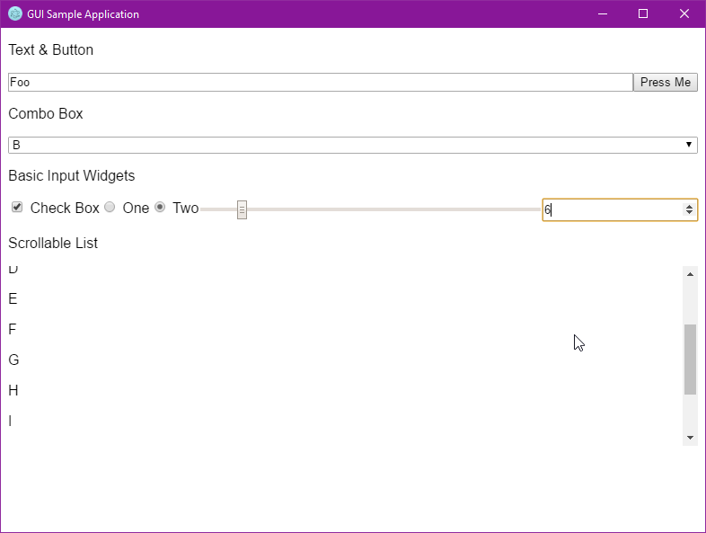

# GUIs/javascript/electron

It's Electron. The HTML is exactly the same as the Web HTML, and the client JS is almost the same.

## Screenshots

### Windows

## Metrics

- Lines of code: **179** (counted naïvely)
- Distinct API calls: **12** (decided somewhat arbitrarily)
- Launch time: (measured on a system under normal load with /misc/MeasureTiming.ahk)
  - Unpackaged (`electron .`): **1.011960 s**
  - Packaged (`app/app.exe`): **0.961285 s**
- Idle RAM usage: **44,128 K** (measured by Windows on a system under normal load)
- Executable size: (measured by Windows, created with [electron-packager](https://github.com/electron-userland/electron-packager))
  - Uncompressed: **131 MB**
  - .zipped: **50.1 MB**
