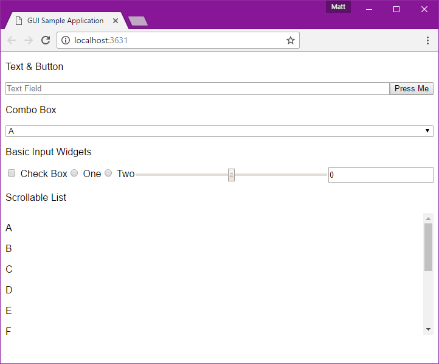
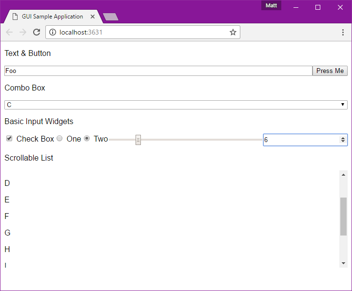
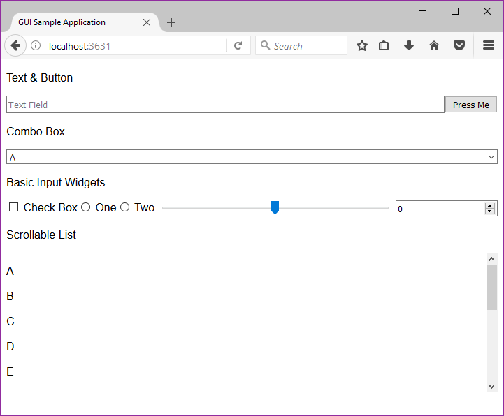
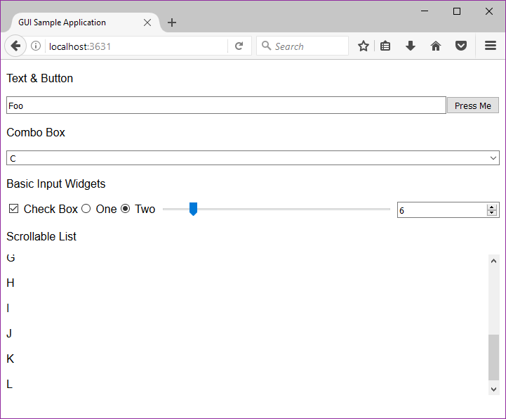
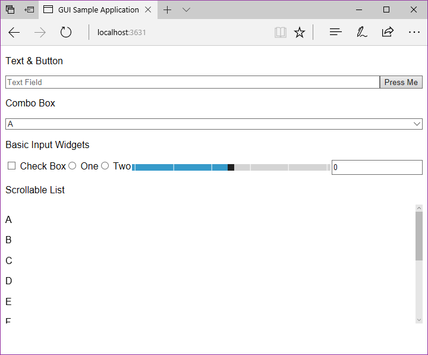
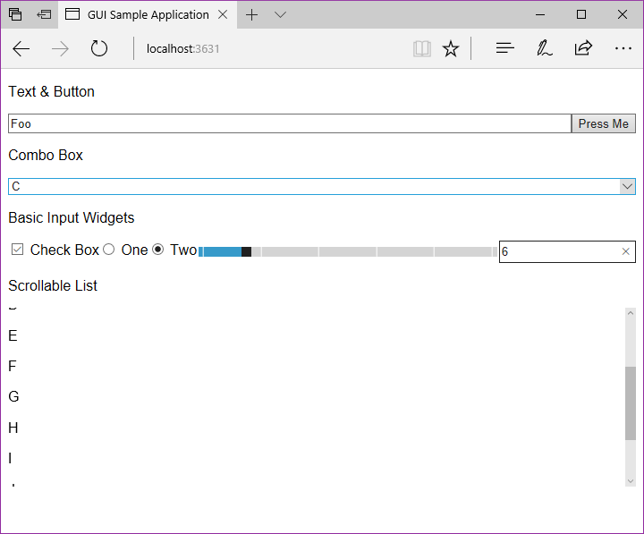
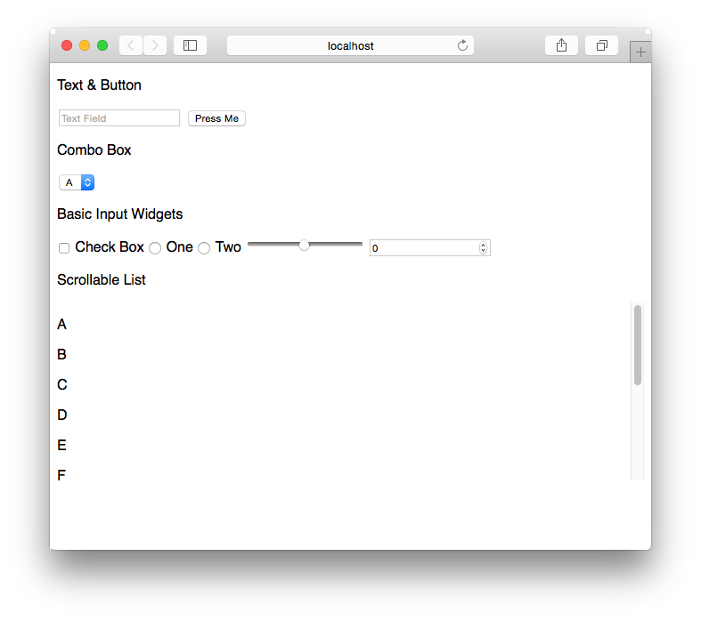
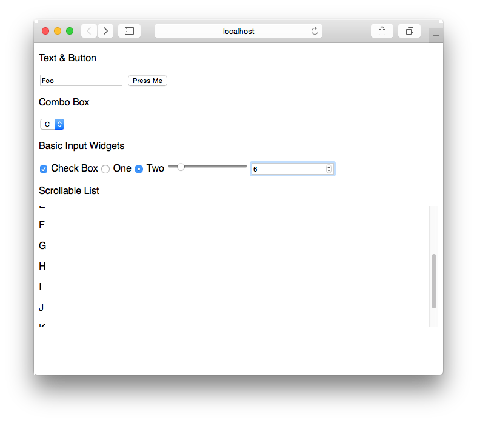

# GUIs/javascript/web

Uses [express](https://expressjs.com/) to expose an HTML interface and accept input over HTTP. Logs output from the server to simulate doing actual work from the server rather than in the browser. (If your application can be written entirely in the browser, don't write a native application. This project is for comparing GUIs for native applications.)

## Screenshots

### Windows & Chrome

### Windows & Firefox

### Windows & Edge

### Mac OS & Old Safari

## Metrics

- Lines of code: **174** (counted naïvely)
- Distinct API calls: **13** (decided somewhat arbitrarily)
- Launch time: (measured on a system under normal load with /misc/MeasureTiming.ahk)
  - `npm start`: **3.016882 s**
  - `node server.js`: **1.007301 s**
- Idle RAM usage: (measured by Windows on a system under normal load)
  - Server + Windows Chrome: **47,696 K** (**17,756 K** + **29,940 K**)
  - Server + Windows Firefox: **44,572 K** (**17,756 K** + **26,816 K**)
  - Server + Windows Edge: **45,188 K** (**17,756 K** + **27,432 K**)
- Executable size: **19.0 MB** (measured by Windows, created with [pkg](https://github.com/zeit/pkg))
